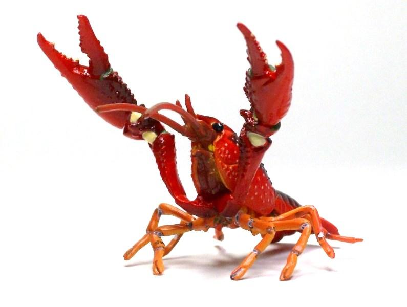

# Crayfish
Crayfish - A/B test framework inspired by [Siberi-android](https://github.com/mercari/siberi-android).

 - In Japanese, `A/B` is written as `えーびー`.
 - `えーびー` sounds like `海老` to Japanese people.
 - BTW, `海老` is a shrimp in English
 - Crayfish is a kind of shrimps.
 - Hence I name this library as `Crayfish` in association with `A/B`.
